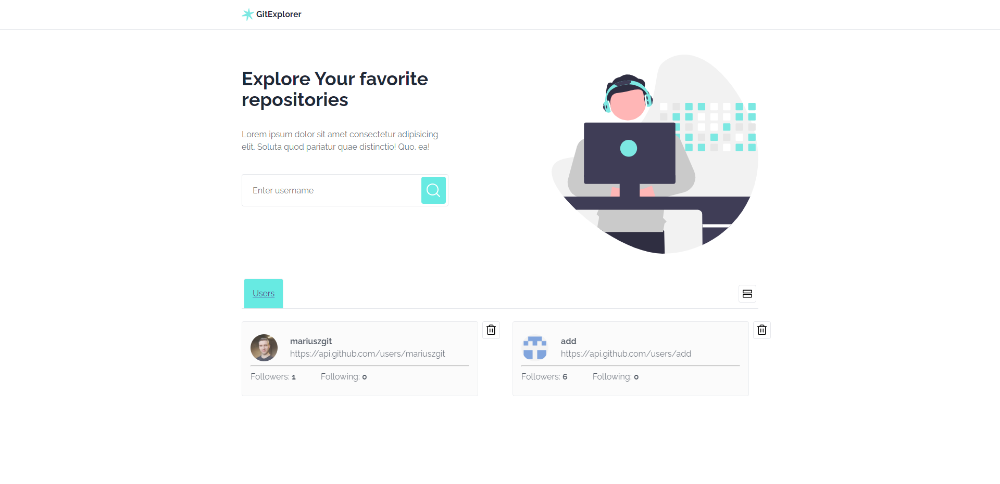

# GitHub explorer

> REACT App for exploring GitHub repoitories
> Live demo [_here_](https://mariuszgit.github.io/react_git-explorer/).

## General Information
This is a testing task.

## Technologies Used
- HTML5, CSS
- Flexbox, Grid
- CSS (styled components)
- React, React Router v5
- fetch API

## Screenshot

